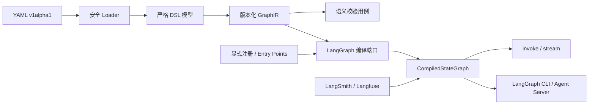

# GraphGPT 架构说明（v0.1）

## 目标边界

GraphGPT 只负责“声明、验证、绑定和编译”，执行语义、checkpoint、stream、interrupt 与
Agent Server 均由原生 LangGraph 提供。复杂业务逻辑继续使用 Python，YAML 不执行表达式。

## 模块与依赖方向

| 层 | 路径 | 职责 | 禁止依赖 |
|---|---|---|---|
| Domain | `graphgpt/domain` | IR、诊断、稳定错误语义 | Pydantic、LangGraph、CLI |
| Application | `graphgpt/application` | DSL→IR、校验、端口 | 具体框架适配器 |
| DSL adapter | `graphgpt/dsl` | v1alpha1 边界模型与 Schema | LangGraph |
| Framework adapters | `graphgpt/adapters` | YAML、LangGraph 公共 API | CLI 细节 |
| Composition | `api.py`、`registry.py`、`cli.py` | 依赖装配、插件和用户入口 | — |

依赖只向内流动。LangGraph API 变化被限制在 `langgraph_compiler.py`；未来增加 TypeScript
编译后端时，复用同一 JSON IR 契约即可。

## 扩展点

1. 项目显式 `BindingRegistry`，优先级最高，适合测试和应用内装配；
2. `graphgpt.nodes` entry point，适合独立插件包；
3. 内置适配器：`langchain:model`、`langchain:agent`、`langgraph:tool-node`；
4. `python:module.symbol` 逃生舱，受模块 allowlist 限制；
5. checkpointer/store 使用同一运行时解析端口，`server-managed` 明确交给平台。

后续插件工厂会独立引入协议版本，在 v0.1 中不提前冻结过宽 API。

## 可观测性

编译器不依赖观测厂商。LangSmith 使用其标准环境变量和 LangChain callback 传播；Langfuse
通过 `langfuse.langchain.CallbackHandler` 在 invoke/stream 边界注入。这保证关闭追踪时不会
触发网络调用，并允许未来加入 OpenTelemetry 适配器。

## 安全模型

- `yaml.safe_load`，拒绝对象构造标签；
- schema 默认拒绝未知字段；
- `validate` 只做静态工作，不导入用户模块；
- Python 引用不接受调用表达式，且必须命中 `allowedModules`；
- 插件安装与 secret 配置不允许由 workflow 自动执行；
- 生成 `.env` 只包含空占位，不写入真实凭据。

## v0.1 有意保留的限制

- 自定义 Reducer 先通过 Python state/原生图逃生，DSL 内置 `add` 与 `messages`；
- `Command`、`Send`、子图与 retry/cache 的稳定 DSL 延后到 0.2；
- 项目名 GraphGPT 与现有图学习研究项目存在同名，Python distribution 使用
  `graphgpt-builder`，import/CLI 保持 `graphgpt`。

