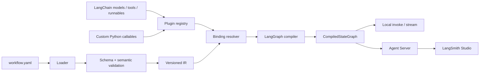

# GraphGPT 项目规划

> 面向 LangGraph 1.x / LangChain 1.x 生态的声明式状态图编译器与开发工具链  
> 文档状态：Draft v0.1  
> 更新日期：2026-08-05  
> 规划周期：MVP/Beta 约 10 周，RC 约 14 周，v1.0 约 20 周

## 1. 执行摘要

GraphGPT（下文简称 GraphGPT）拟建设为一个开源、Python 优先的声明式工作流工具：开发者使用 YAML 描述状态、节点、边、路由、子图、持久化和运行策略，GraphGPT 将其解析为稳定的中间表示（IR），完成静态校验，再直接编译为 LangGraph `StateGraph` / `CompiledStateGraph`。

项目不另造 Agent Runtime，也不复制 LangGraph Studio。它的核心价值是补齐以下开发体验：

- 让图结构、业务处理函数和运行配置解耦；
- 在运行前发现结构、状态、插件、路由和兼容性问题；
- 原生复用 LangChain 的模型、工具、Runnable、Retriever、Embeddings 与回调生态；
- 生成符合 `langgraph.json` 约定、可被 LangGraph CLI、Agent Server 和 LangSmith Studio 加载的项目；
- 为配置迁移、可视化编辑器和多语言前端保留稳定、版本化的 IR 与 JSON Schema。

需要特别说明：尽管项目名中包含 DAG，LangGraph 支持循环、动态分支、并行 fan-out、子图和中断恢复，因此 GraphGPT 的语义模型必须是“有状态有向图”，不能在实现上限制为无环图。DAG 仅代表项目品牌与其中一种常用工作流形态。

## 2. 背景与机会

LangGraph 是面向长时运行、有状态 Agent 的低层编排框架。它提供持久化、耐久执行、人机协作、流式输出、子图和时间旅行等能力；LangChain 1.x 则提供模型、工具、Agent、结构化输出和中间件等高层组件。当前开发者仍主要通过 Python/TypeScript 代码手工拼装图结构。

GraphGPT 的机会不是把代码“全部 YAML 化”，而是建立一个边界清晰的声明层：

1. 适合声明的部分进入 DSL：状态结构、节点绑定、边、条件路由、执行策略和资源引用。
2. 需要编程表达力的部分留在 Python：业务逻辑、复杂条件、外部系统访问和自定义 Reducer。
3. 二者通过类型化注册表与明确协议连接，避免在 YAML 中嵌入任意 Python 表达式。

### 2.1 目标用户

- 已使用 LangGraph，希望减少样板代码并提升可维护性的 Python 团队；
- 需要复用标准流程模板的 Agent 平台团队；
- 希望在代码评审中清晰查看图结构变更的工程团队；
- 后续希望构建可视化编辑器，但不愿绑定专有 Runtime 的工具开发者。

### 2.2 核心使用场景

- 聊天 Agent：`MessagesState`、模型节点、工具循环和流式输出；
- RAG：检索、重排、生成及失败降级；
- HITL：审批、修改状态、拒绝或恢复执行；
- 多 Agent：协调器、专家子图和共享/隔离状态；
- Map-reduce：通过 `Send` 动态分发并用 Reducer 聚合；
- 业务工作流：确定性步骤与 LLM 节点混合编排。

## 3. 产品定位

### 3.1 一句话定位

> 将版本化 YAML 工作流安全地编译为原生 LangGraph，并无缝接入 LangChain 组件、LangGraph CLI 与 LangSmith 工具链。

### 3.2 设计原则

1. **原生优先**：产物是原生 LangGraph 对象，不引入第二套运行时语义。
2. **声明结构，编码行为**：YAML 描述拓扑与绑定，Python 承载复杂逻辑。
3. **先校验再运行**：尽可能把错误前移到 `validate` / `compile` 阶段。
4. **显式胜过魔法**：不执行 YAML 中的任意表达式，不依赖隐式全局注册。
5. **生态兼容**：面向 LangChain 标准接口，而非绑定单一模型厂商。
6. **可演进**：DSL、IR、插件协议和生成项目均有独立版本。
7. **可观测且可复现**：配置摘要、编译诊断和运行元数据可追踪。
8. **渐进采用**：既能创建新项目，也能在已有 LangGraph 项目中只采用编译器核心。

### 3.3 MVP 范围

MVP 必须交付：

- YAML DSL `v1alpha1` 与 JSON Schema；
- 状态、节点、普通边、条件边、循环和 START/END；
- Python callable、LangChain Runnable、模型和工具节点注册；
- YAML → AST → IR → LangGraph 的内存编译；
- `init`、`validate`、`inspect`、`run`、`doctor` CLI；
- `langgraph.json` 与可导入 graph 模块生成；
- Chat、Branch、Loop、Tool-use、RAG 五个模板；
- 单元、契约、快照和最小端到端测试；
- 清晰的版本兼容矩阵和迁移机制。

### 3.4 非目标

- 不实现独立于 LangGraph 的调度、Checkpoint 或分布式执行引擎；
- 不在 MVP 中建设生产级拖拽 UI；
- 不在 YAML 中支持 `eval`、模板表达式或任意代码执行；
- 不抽象所有 LangGraph API，罕见高级用法允许退回原生 Python；
- 不承诺 Python 与 TypeScript 双端在 v1.0 前完全对等；
- 不把 LangSmith 设为硬依赖，本地运行和测试必须可以关闭远程追踪。

## 4. 成功指标

### 4.1 产品指标

- 新用户在 10 分钟内从模板启动一个可在 `langgraph dev` 中运行的图；
- 五类官方模板均能通过 GraphGPT 编译并在 Agent Server/Studio 中加载；
- 常见 DSL 错误在执行前给出路径、错误码、原因和修复建议；
- 80% 的常见图模式无需编写图装配代码，只需实现节点函数；
- 从 DSL 生成的图与等价手写图在行为契约测试中一致。

### 4.2 工程质量门槛

- 核心包测试覆盖率不低于 90%，分支覆盖率不低于 85%；
- 公共 API、DSL 和插件协议均有语义版本及变更日志；
- 支持矩阵内的最低版本与最新兼容版本均进入 CI；
- 编译 100 节点静态图的冷启动目标低于 500 ms（不含外部插件导入时间）；
- 无高危依赖漏洞；发布包具备 SBOM、签名/来源证明和可复现构建记录。

## 5. 总体架构



### 5.1 分层职责

#### A. DSL 层

- 负责用户可读、可审查的 YAML 表达；
- 使用 `apiVersion` 与 `kind` 标识版本和资源类型；
- 支持环境变量“引用”，不把 secret 展开写入编译产物或日志；
- 通过 JSON Schema 为编辑器提供补全和即时诊断。

#### B. 解析与校验层

- YAML 解析并保留源文件行列位置；
- 结构校验：字段类型、枚举、必填项、未知字段策略；
- 语义校验：重复节点、悬空边、不可达节点、无终止路径、Reducer 缺失、路由目标不合法、子图接口不匹配；
- 兼容性校验：DSL 版本、GraphGPT 版本、LangGraph/LangChain 支持范围；
- 诊断统一为 `code + severity + path + location + message + hint`。

#### C. 中间表示（IR）层

IR 是项目长期稳定性的核心，不应让 YAML 模型直接依赖 LangGraph 内部类。

建议实体：

- `GraphIR`：元数据、输入/输出 schema、上下文 schema、节点和边；
- `StateIR` / `ChannelIR`：类型、默认值、Reducer 引用；
- `NodeIR`：节点种类、实现引用、输入映射、重试、缓存和 metadata；
- `EdgeIR`：direct、conditional、command、send 四类控制关系；
- `ResourceIR`：model、tool、retriever、store、checkpointer 等资源；
- `SubgraphIR`：子图来源、输入输出映射和持久化策略；
- `SourceMap`：IR 元素到 YAML 文件行列的映射。

#### D. 注册与适配层

使用 `importlib.metadata` entry points 和显式项目注册表，按优先级解析：

1. 项目内显式注册；
2. 已安装的 GraphGPT 插件 entry point；
3. GraphGPT 内置适配器。

首批协议：

- `NodeFactory`：构造同步/异步 LangGraph 节点；
- `RunnableFactory`：解析 LangChain `Runnable`；
- `ModelFactory`：基于 `init_chat_model` 或 provider package 构造模型；
- `ToolFactory`：解析 `BaseTool` 或 `@tool` callable；
- `ReducerFactory`：构造状态合并函数；
- `CheckpointerFactory` / `StoreFactory`：开发环境显式配置，Agent Server 模式可交由服务管理。

#### E. 编译层

编译器只使用 LangGraph 公共 API：

1. 根据 IR 构造状态、输入、输出与上下文 schema；
2. 解析节点、资源和子图绑定；
3. 调用 `StateGraph.add_node`、`add_edge`、`add_conditional_edges`；
4. 将动态 fan-out 映射为 `Send`，将状态更新与跳转映射为 `Command`；
5. 应用 checkpointer、store、interrupt、cache 等编译选项；
6. 调用 `compile()`，输出原生 `CompiledStateGraph`；
7. 附加只读 GraphGPT 构建元数据，便于诊断和追踪。

编译器默认采用“运行时直接构图”，不是生成并执行 Python 源代码。导出 Python 仅作为可选的调试/迁移能力，且必须可读、确定性生成，不作为主运行路径。

#### F. CLI 与项目生成层

计划命令：

```text
graphgpt init [template]       创建项目或工作流模板
graphgpt validate [path]       结构、语义和兼容性校验
graphgpt inspect [path]        输出规范化 IR、拓扑与诊断
graphgpt run [path]            本地 invoke/stream 调试
graphgpt dev [path]            生成配置并委托 langgraph dev
graphgpt export [path]         导出 JSON Schema、Mermaid 或可选 Python
graphgpt doctor                检查 Python、包版本、插件与环境
graphgpt migrate [path]        升级 DSL 版本并生成差异
```

`graphgpt dev` 应明确是对 LangGraph CLI 的薄封装，而不是另起一个开发服务器。

### 5.2 建议仓库布局

```text
graphgpt/
├── packages/
│   ├── graphgpt-core/              # DSL、IR、诊断、编译器
│   ├── graphgpt-cli/               # CLI 与模板
│   ├── graphgpt-langchain/         # LangChain 标准组件适配
│   └── graphgpt-testkit/           # 插件与图的契约测试工具
├── examples/
│   ├── chat/
│   ├── branch/
│   ├── loop/
│   ├── tool-use/
│   └── rag/
├── schemas/                   # 发布的 DSL JSON Schema
├── tests/
│   ├── compatibility/
│   └── e2e/
├── docs/
├── pyproject.toml
├── langgraph.json             # 文档/演示 graph，可选
└── README.md
```

早期也可用单包 `src/graphgpt/` 启动；在插件 API 稳定前，不应为了“看起来模块化”过早拆成多个独立发布包。建议在 M2 结束时根据依赖边界决定是否物理拆包。

## 6. DSL 初稿

下面的示例用于验证表达能力，不代表最终字段名：

```yaml
apiVersion: graphgpt.dev/v1alpha1
kind: Workflow
metadata:
  name: support-agent

spec:
  state:
    type: messages
    fields:
      intent:
        type: string
        required: false

  context:
    fields:
      tenant_id: { type: string }

  resources:
    models:
      default:
        factory: langchain.init_chat_model
        config:
          model: ${MODEL_NAME}

  nodes:
    classify:
      use: python:my_agent.nodes.classify
    agent:
      use: langchain:agent
      with:
        model: resource:models.default
        tools:
          - python:my_agent.tools.search_orders

  edges:
    - from: $start
      to: classify
    - from: classify
      route:
        use: python:my_agent.routes.by_intent
        targets: [agent, $end]
    - from: agent
      to: $end

  runtime:
    interruptBefore: []
    interruptAfter: []
```

### 6.1 DSL 约束

- `${NAME}` 只代表环境变量引用，解析时保留来源并支持敏感标记；
- `python:module.symbol` 只能导入允许范围内的符号，不接受函数调用语法；
- 路由必须声明可能目标，便于静态校验和图可视化；
- Reducer 必须显式声明或由内置 state 类型提供；
- 未知字段在 `v1alpha1` 默认报错，避免拼写错误被静默忽略；
- 节点返回值与状态更新在运行前尽可能做类型检查，运行时保留轻量防线；
- 所有序列化配置必须可生成脱敏、稳定排序的规范化表示。

## 7. LangGraph 与 LangChain 集成路线

### 7.1 LangGraph 能力映射

| LangGraph 能力 | GraphGPT 表达 | 首次交付 |
|---|---|---|
| `StateGraph`、START/END | state、nodes、edges | M1 |
| Reducer / channels | state field reducer | M1 |
| 条件边、循环 | route + declared targets | M1 |
| `Command` | command node/route adapter | M2 |
| `Send` / map-reduce | fanOut + aggregate reducer | M2 |
| Persistence / Store | runtime resource + server-managed mode | M2 |
| Interrupt / resume | runtime interrupt + node interrupt adapter | M2 |
| Streaming | CLI stream mode，透传原生 stream events | M2 |
| Subgraph | workflow reference + schema mapping | M3 |
| Retry / cache / metadata | node policy | M3 |
| Functional API | 允许作为 callable/entrypoint 节点；不重编译函数体 | v1.x |

### 7.2 LangChain 生态映射

- **Models**：优先支持 `init_chat_model`，同时允许 provider 包的显式 factory；
- **Tools**：接受 LangChain `BaseTool`、`@tool` 结果和兼容 callable；
- **Runnables**：节点适配 `Runnable.invoke/ainvoke`，配置与 callback 透传；
- **Agents**：把 `create_agent` 生成的 LangGraph 图作为子图或节点使用；
- **Structured output**：允许 Pydantic、TypedDict 或 JSON Schema 引用，不复制 LangChain 的策略选择逻辑；
- **Retriever / Embeddings / VectorStore**：作为可选资源插件，不放入最小核心依赖；
- **Callbacks / tracing**：保持 `RunnableConfig`、tags、metadata、thread ID 透传，兼容 LangSmith 追踪；
- **Middleware**：通过 Agent factory 配置或 Python 注册，不在首版 DSL 中重新设计一套中间件语言。

### 7.3 LangGraph CLI、Agent Server 与 Studio

GraphGPT 生成或维护：

- 一个可导入的 Python 模块，例如 `my_agent/graph.py:graph`；
- 一个标准 `langgraph.json`，其中 `graphs` 指向该已编译图或 graph factory；
- 依赖声明和 `.env.example`，但绝不生成真实 secret；
- 可选 Studio-friendly metadata。

验收路径：

```text
graphgpt validate workflow.yaml
        ↓
graphgpt dev workflow.yaml
        ↓
langgraph dev -c langgraph.json
        ↓
Agent Server API / LangSmith Studio
```

Studio 是外部可视化、交互和调试工具，GraphGPT 只保证生成兼容的图和项目结构。

## 8. 技术路线与选型

### 8.1 基线选型

| 领域 | 建议 | 理由 |
|---|---|---|
| 语言 | Python 3.11+ | 与当前 LangGraph CLI 基线一致，类型生态成熟 |
| 包管理 | `uv` + PEP 621 | 快速、锁文件清晰、适合 workspace |
| 数据模型 | Pydantic v2 | DSL/IR 校验与 JSON Schema 生成 |
| YAML | `ruamel.yaml` | 保留行列和注释，利于诊断与迁移 |
| CLI | Typer | 类型化命令与较好帮助信息 |
| 插件发现 | `importlib.metadata.entry_points` | Python 标准机制，避免私有扫描 |
| 测试 | pytest、pytest-asyncio、Hypothesis | 单元、异步与属性测试 |
| 质量 | Ruff、Pyright 或 mypy | 格式、lint 与类型检查 |
| 文档 | MkDocs Material | 版本化文档、搜索和示例友好 |
| 发布 | PyPI + GitHub Releases | Python 社区标准分发 |

### 8.2 依赖与兼容策略

截至本文日期，本项目已在 LangGraph 1.2.10 上完成 v0.1 兼容验证。GraphGPT 不应依赖未公开的内部实现，建议：

- 初始开发基线围绕 LangGraph 1.2.x 和 LangChain 1.x 做兼容性 spike；
- 在 spike 完成前，不把未经验证的最低版本写死为长期承诺；
- 包元数据采用可控的主版本范围，锁文件保存开发环境的精确版本；
- CI 至少包含“最低支持组合”“当前锁定组合”“允许范围内最新组合”；
- 每次 LangGraph 次版本升级运行编译快照与行为契约测试；
- 将公共 API 适配集中在 `compat/`，禁止 LangGraph 版本判断散落业务代码；
- 对 beta 能力（例如当前文档标记为 beta 的 `DeltaChannel`）使用 feature flag，不进入 v1 稳定 DSL 承诺。

最终支持矩阵应由 M0 spike 产出，例如：

| GraphGPT | Python | LangGraph | LangChain Core | DSL |
|---|---|---|---|---|
| 0.1.x | 3.11–3.13 | 经 M0 验证后填写 | 经 M0 验证后填写 | v1alpha1 |

### 8.3 错误模型

稳定错误码示例：

- `GraphGPT-SCHEMA-001`：缺少必填字段；
- `GraphGPT-GRAPH-004`：边引用不存在节点；
- `GraphGPT-GRAPH-011`：并行写入字段缺少 Reducer；
- `GraphGPT-PLUGIN-003`：插件不存在或版本不兼容；
- `GraphGPT-BIND-007`：导入符号不符合所需协议；
- `GraphGPT-COMPAT-002`：当前 LangGraph 版本不在支持矩阵；
- `GraphGPT-SEC-001`：Python 引用超出允许的模块范围。

错误码从第一次公开预览版起保持稳定；措辞可以改进，错误语义不可静默复用。

## 9. 安全设计

YAML 工作流和插件本质上会触发代码导入与外部调用，安全不能等到发布前补做。

- 使用安全 YAML loader，拒绝自定义对象反序列化；
- 禁止 `eval`、`exec`、Jinja/Python 表达式和 YAML 任意构造标签；
- Python 符号只允许 `module.symbol`，并支持项目级 allowlist/denylist；
- `graphgpt validate` 默认不实例化模型、工具或访问网络；
- `graphgpt inspect` 和日志默认脱敏环境变量、token、URL 凭据与 provider headers；
- 插件安装是显式操作，工作流不能自动安装依赖；
- 远程模板必须校验来源和完整性，MVP 只启用本地/内置模板；
- 节点副作用、interrupt 前操作和恢复幂等性在 lint 规则与文档中明确提示；
- 发布流程启用依赖审计、secret 扫描、SBOM 和供应链来源证明；
- 明确威胁模型：可信项目配置与不可信第三方配置是两种运行模式，后者默认只允许静态校验。

## 10. 测试与质量策略

### 10.1 测试金字塔

1. **模型单元测试**：DSL、IR、迁移和错误码；
2. **属性测试**：随机合法/非法拓扑、规范化幂等性、迁移可重复性；
3. **编译快照**：规范化 IR 和 `graph.get_graph()` 的稳定表示；
4. **行为契约测试**：生成图与手写 LangGraph 在输入、状态更新、路由和异常上的等价性；
5. **插件契约测试**：同步/异步、RunnableConfig、stream、错误传播；
6. **端到端测试**：模板 → validate → compile → invoke/stream；
7. **生态集成测试**：`langgraph dev` 启动、Agent Server health、Studio 可加载协议；
8. **兼容矩阵测试**：最低、锁定、最新允许版本。

### 10.2 关键验收用例

- 循环图可正常编译，不被错误判为非法 DAG；
- 并行写入无 Reducer 时编译失败并定位字段；
- interrupt 后使用相同 thread 恢复，不重复非幂等副作用；
- 子图状态映射错误在运行前被发现；
- async 节点不被同步 wrapper 阻塞；
- LangChain tool schema、异常和 tool message 可正确透传；
- 关闭 LangSmith tracing 后，本地测试不向外发送数据；
- 无凭据出现在异常、IR dump、快照和生成文件中。

## 11. 里程碑

### M0：技术验证与边界冻结（第 1–2 周）

目标：消除版本、装载和原生兼容风险。

交付物：

- 3 个 spike：基础循环图、Tool Agent、interrupt + checkpointer；
- `langgraph.json` 加载和 `langgraph dev` 端到端验证；
- LangGraph/LangChain 精确兼容矩阵；
- ADR-001（运行时编译 vs 代码生成）；
- ADR-002（DSL/IR 版本策略）；
- 最小威胁模型。

退出标准：同一 DSL 原型可编译、invoke、stream，并被 Agent Server 加载。

### M1：编译器核心 Alpha（第 3–6 周）

目标：形成可测试的 YAML → 原生 LangGraph 主链路。

交付物：

- DSL `v1alpha1`、JSON Schema、SourceMap；
- GraphIR 与统一诊断；
- state、node、direct/conditional edge、loop、Reducer；
- Python callable 和 Runnable 注册；
- `validate`、`inspect`、`run`；
- Chat、Branch、Loop 模板；
- 单元、属性和行为契约测试。

退出标准：核心功能覆盖率达标，三个模板与等价手写图行为一致。

### M2：生态集成 Beta（第 7–10 周）

目标：打通 LangChain 与 LangGraph 开发工具链。

交付物：

- models、tools、agent/Runnable 适配；
- `Command`、`Send`、stream；
- checkpointer、store、interrupt 配置；
- Tool-use、RAG 模板；
- `init`、`dev`、`doctor`；
- 标准 `langgraph.json` 与 graph module 生成；
- Agent Server / Studio 集成测试；
- 安全审计第一轮。

退出标准：五个模板均可通过 `graphgpt dev` 在 Studio 中调试；本地模式无需 LangSmith。

### M3：可扩展性与 RC（第 11–14 周）

目标：稳定插件协议和复杂工作流能力。

交付物：

- 子图、状态映射、重试、缓存和 metadata；
- entry point 插件机制与 `graphgpt-testkit`；
- DSL 自动迁移与兼容性提示；
- Mermaid/JSON 导出；
- 性能基准、SBOM、发布签名；
- 完整教程、插件开发指南与迁移指南。

退出标准：至少 2 个独立示例插件通过契约套件；无阻断级已知缺陷。

### M4：v1.0 稳定版（第 15–20 周）

目标：稳定公共契约并建立社区治理。

交付物：

- DSL `v1` 与稳定插件 API；
- LTS/弃用策略；
- 安全政策、贡献指南、行为准则和 RFC 流程；
- 真实项目迁移案例与性能报告；
- v1.0 PyPI/GitHub 发布。

退出标准：两个非维护者团队完成试用；v1 阻断问题清零；发布与回滚演练通过。

### 后续候选（v1.x / v2）

- Web 可视化编辑器，直接读写相同 DSL/IR；
- TypeScript 编译后端；
- LSP、VS Code 扩展与图差异评审；
- 策略包、组织级模板仓库和 OPA 风格治理；
- 从有限范围的现有 `StateGraph` 反向导出 IR；
- 可复现的远程模板/插件签名仓库。

## 12. 待办事项清单

状态约定：`[ ]` 未开始，`[~]` 进行中，`[x]` 完成。优先级：P0 阻断，P1 重要，P2 增强。

### 12.1 M0 — 决策与 Spike

- [x] **GraphGPT-001 / P0** 建立 Python 3.11+ `uv` 项目、CI 和质量工具；验收：本地与 CI 可运行 lint、typecheck、test、build。
- [x] **GraphGPT-002 / P0** 验证 LangGraph 1.2.x 的基础图、循环、条件边和 Reducer；验收：形成可执行 spike 与记录。
- [~] **GraphGPT-003 / P0** 验证 LangChain model/tool/create_agent 的嵌入方式；验收：工具循环可 invoke/stream。
- [~] **GraphGPT-004 / P0** 验证 checkpointer、interrupt、resume 和 thread ID；验收：进程内恢复用例通过且副作用次数正确。
- [x] **GraphGPT-005 / P0** 验证 `langgraph.json`、`langgraph dev` 与 Studio 装载；验收：示例图在 Agent Server 可调用。
- [x] **GraphGPT-006 / P0** 形成兼容矩阵和 `compat/` 策略；依赖：GraphGPT-002～005。
- [x] **GraphGPT-007 / P0** 编写 ADR-001、ADR-002 和初版威胁模型。

### 12.2 M1 — DSL、IR 与编译器

- [x] **GraphGPT-101 / P0** 定义 `v1alpha1` Pydantic 模型与 JSON Schema；验收：schema 可用于 YAML 编辑器补全。
- [~] **GraphGPT-102 / P0** 实现带 SourceMap 的安全 YAML Loader；验收：所有诊断包含文件与行列。
- [x] **GraphGPT-103 / P0** 实现 GraphIR、规范化和确定性序列化；验收：重复执行结果字节级稳定。
- [~] **GraphGPT-104 / P0** 实现结构与语义校验器；验收：覆盖重复、悬空、不可达、目标集合、Reducer 等规则。
- [x] **GraphGPT-105 / P0** 实现统一错误码与 human/JSON 两种输出。
- [x] **GraphGPT-106 / P0** 实现状态 schema 和 Reducer 编译。
- [x] **GraphGPT-107 / P0** 实现普通节点、边、条件边、START/END 与循环编译。
- [x] **GraphGPT-108 / P0** 实现显式 Python callable/Runnable 注册表。
- [x] **GraphGPT-109 / P1** 实现 `validate`、`inspect`、`run`。
- [x] **GraphGPT-110 / P1** 提供 Chat、Branch、Loop 模板与行为等价测试。

### 12.3 M2 — LangChain 与开发工具链

- [~] **GraphGPT-201 / P0** 实现 LangChain model factory，敏感配置只接受引用。
- [~] **GraphGPT-202 / P0** 实现 `BaseTool`、`@tool` 和 ToolNode 适配及契约测试。
- [ ] **GraphGPT-203 / P0** 实现 `Command` 与声明目标校验。
- [ ] **GraphGPT-204 / P0** 实现 `Send` fan-out 和聚合 Reducer 校验。
- [~] **GraphGPT-205 / P0** 透传 sync/async invoke、stream、RunnableConfig、tags 和 metadata。
- [~] **GraphGPT-206 / P0** 实现 checkpointer、store、interrupt 与 server-managed 模式。
- [x] **GraphGPT-207 / P0** 生成可导入 graph module 与标准 `langgraph.json`。
- [x] **GraphGPT-208 / P1** 实现 `init`、`dev`、`doctor`。
- [x] **GraphGPT-209 / P1** 提供 Tool-use、RAG 模板；RAG provider 作为 optional extra。
- [~] **GraphGPT-210 / P0** 增加 Agent Server/Studio 端到端测试。
- [~] **GraphGPT-211 / P0** 增加日志脱敏、secret 扫描和恶意 YAML 测试。

### 12.4 M3 — 插件、子图与发布准备

- [x] **GraphGPT-301 / P0** 实现子图引用、输入输出映射和持久化模式。
- [x] **GraphGPT-302 / P1** 实现节点 retry、cache、metadata 策略。
- [x] **GraphGPT-303 / P0** 冻结 entry point 名称与插件协议候选版。
- [ ] **GraphGPT-304 / P0** 发布 `graphgpt-testkit` 插件契约测试。
- [ ] **GraphGPT-305 / P0** 实现 `migrate` 和 DSL 版本升级测试。
- [~] **GraphGPT-306 / P1** 实现 Mermaid、规范化 JSON 与可选 Python 导出。
- [ ] **GraphGPT-307 / P1** 建立 10/100/1000 节点编译与内存基准。
- [~] **GraphGPT-308 / P0** 完成文档站、教程、API、插件和迁移文档。
- [ ] **GraphGPT-309 / P0** 完成依赖审计、SBOM、签名和发布 dry-run。

### 12.5 M4 — 稳定版与治理

- [ ] **GraphGPT-401 / P0** 收集至少两个外部试点的兼容与可用性反馈。
- [ ] **GraphGPT-402 / P0** 将 DSL 从 `v1alpha1` 迁移并冻结为 `v1`。
- [ ] **GraphGPT-403 / P0** 冻结公共 Python API、CLI 退出码和插件契约。
- [~] **GraphGPT-404 / P0** 发布弃用、支持与安全响应政策。
- [x] **GraphGPT-405 / P1** 建立 RFC、贡献指南、行为准则和 maintainer 流程。
- [ ] **GraphGPT-406 / P0** 完成 v1.0 发布、升级和回滚演练。

## 13. 发布与版本策略

- Python 包遵循 SemVer；0.x 阶段允许快速调整，但必须有迁移说明；
- DSL 使用独立 `apiVersion`，不会因包补丁升级而改变语义；
- IR 是内部稳定边界，公开导出格式单独带 `irVersion`；
- 插件入口点和协议版本独立检查，错误信息给出可兼容范围；
- 废弃项至少跨一个次版本保留警告，稳定 DSL 字段原则上跨两个次版本；
- 每个发布包含变更日志、兼容矩阵、迁移命令、SBOM 和已知问题；
- Release candidate 必须完成五个模板、兼容矩阵和 Agent Server 端到端验证。

## 14. 开源治理

### 14.1 许可证建议

建议采用 Apache-2.0：对商业采用友好，同时提供明确的专利授权。正式落地前需确认所有引入代码、模板和素材的许可证兼容性。

### 14.2 决策机制

- 小型实现决策通过 issue/PR；
- DSL、IR、插件协议、兼容政策变化必须走 RFC；
- 关键架构决策记录为 ADR，不在聊天或单个 PR 中隐式决定；
- 安全问题使用私密报告渠道，不要求公开 issue；
- 初期采用 maintainer approval，成熟后建立 reviewer/maintainer 晋升规则。

### 14.3 社区基础文件

- `LICENSE`、`NOTICE`；
- `CONTRIBUTING.md`、`CODE_OF_CONDUCT.md`；
- `SECURITY.md`、支持版本说明；
- Issue/PR 模板、RFC/ADR 模板；
- 公共 roadmap 与 good-first-issue 标签体系。

## 15. 风险与缓解

| 风险 | 影响 | 概率 | 缓解措施 |
|---|---|---:|---|
| LangGraph 公共 API 快速演进 | 高 | 中 | 仅依赖公共 API、集中 compat 层、版本矩阵 CI |
| DSL 试图覆盖所有 Python 能力 | 高 | 高 | 明确逃生舱：复杂逻辑用 Python callable/subgraph |
| YAML 调试体验差 | 高 | 中 | SourceMap、稳定错误码、hint、JSON 输出、编辑器 schema |
| 名称让用户误以为只支持 DAG | 中 | 高 | 文档首屏声明“state graph, cycles supported”，CLI 检查不禁止循环 |
| 插件执行不可信代码 | 高 | 中 | 显式安装、allowlist、静态校验模式、威胁模型 |
| Secret 泄漏到生成物或追踪 | 高 | 中 | 引用式配置、统一脱敏、secret 测试、默认不 dump resolved config |
| 与 Studio/CLI 职责重叠 | 中 | 中 | 坚持薄封装与标准 `langgraph.json`，不复制 Server/Studio |
| 过早建设 UI 拖慢核心 | 中 | 高 | v1.0 前以 DSL、IR、编译器和 LSP 友好为优先 |
| 运行时编译增加启动延迟 | 中 | 低 | IR 缓存、性能预算、确定性 cache key、基准测试 |
| 生成图与手写图语义偏差 | 高 | 中 | 行为契约测试与官方 API 端到端测试 |

## 16. 首个迭代建议（未来 10 个工作日）

### 第 1–2 天：项目骨架

- 初始化包、CI、Ruff、类型检查与 pytest；
- 加入 ADR、RFC、issue 模板；
- 创建最小版本探针和 `graphgpt doctor` 占位。

### 第 3–5 天：LangGraph Spike

- 手写并固定三个基准图：循环、Tool Agent、interrupt；
- 建立可观察行为断言：结果、state history、stream event、resume；
- 验证 Agent Server 装载并记录准确版本组合。

### 第 6–8 天：DSL/IR 垂直切片

- 只实现 `messages state + callable nodes + direct/conditional edges`；
- YAML 解析为带 SourceMap 的 IR；
- 编译并复用前述基准图断言。

### 第 9–10 天：可交付开发体验

- 完成 `graphgpt validate` 与 `graphgpt run` 最小版；
- 生成 `langgraph.json` 和 graph module；
- 写一个从 `graphgpt init chat` 到 Studio 调试的快速开始；
- 召开 M0 评审，冻结 M1 范围，不在此时扩展 UI。

两周演示应展示“一份 YAML → 校验诊断 → 原生 graph → stream → Studio”，而不是展示大量尚未连接的 schema 字段。

## 17. Definition of Done

任一功能只有同时满足以下条件才算完成：

- 有明确用户场景和验收标准；
- sync/async 行为按适用范围均被测试；
- 错误路径有稳定诊断，且不泄漏敏感信息；
- 公共行为有文档、示例和变更记录；
- 支持矩阵 CI 通过；
- 没有绕过 IR 直接散落 LangGraph 版本分支；
- 对生成文件进行确定性/快照检查；
- 对安全或兼容性有影响时更新威胁模型或 ADR。

## 18. 需要在 M0 决定的问题

1. 项目正式名称是否保留 GraphGPT，还是对外简称 GraphGPT 并强调 State Graph；
2. 首个稳定版是否只支持 Python，TypeScript 仅保留 IR 兼容承诺；
3. `create_agent` 应作为黑盒子图还是提供受限的声明式 factory；
4. checkpointer/store 的配置边界：本地模式由 GraphGPT 创建，Server 模式由平台管理到什么程度；
5. Pydantic state 是否进入首版，还是先支持 TypedDict/dataclass 风格模型；
6. 插件隔离是否只做信任模型说明，还是在 v1.0 前提供进程隔离实验；
7. 可选 Python 导出的目标是调试可读性、迁移，还是正式构建产物；
8. 官方模板是否与核心同版本发布，还是建立独立模板仓库。

## 19. 官方依据与延伸阅读

以下资料用于校准本规划的生态边界；实现时应继续以对应版本的官方文档和发布说明为准。

- [LangGraph Overview](https://docs.langchain.com/oss/python/langgraph/overview)：LangGraph 的定位与核心能力；
- [Graph API Overview](https://docs.langchain.com/oss/python/langgraph/graph-api)：State、Node、Edge、Reducer、编译与 Runtime；
- [Use the Graph API](https://docs.langchain.com/oss/python/langgraph/use-graph-api)：条件分支、循环、`Send` 和 `Command`；
- [Persistence](https://docs.langchain.com/oss/python/langgraph/persistence)：Checkpoint、thread、Store、故障恢复与时间旅行；
- [Interrupts](https://docs.langchain.com/oss/python/langgraph/interrupts)：HITL、恢复规则与副作用约束；
- [Subgraphs](https://docs.langchain.com/oss/python/langgraph/use-subgraphs)：子图接口与持久化模式；
- [Streaming](https://docs.langchain.com/oss/python/langgraph/streaming)：同步/异步流式事件；
- [LangChain Agents](https://docs.langchain.com/oss/python/langchain/agents)：`create_agent`、模型、工具和中间件；
- [LangChain Structured Output](https://docs.langchain.com/oss/python/langchain/structured-output)：结构化输出策略；
- [LangSmith Application Structure](https://docs.langchain.com/langsmith/application-structure)：`langgraph.json`、graph 导出与依赖结构；
- [LangGraph CLI](https://docs.langchain.com/langsmith/cli)：本地开发、构建和部署命令；
- [LangSmith Studio](https://docs.langchain.com/langsmith/studio)：图可视化、交互、调试和评估；
- [LangGraph Releases](https://github.com/langchain-ai/langgraph/releases)：版本与变更记录。

---

本规划建议在完成 M0 的真实兼容性 spike 后更新为 v0.2：填入准确依赖版本、确认 DSL 字段、补充 ADR 链接，并把第 12 节待办同步到项目 issue tracker。
